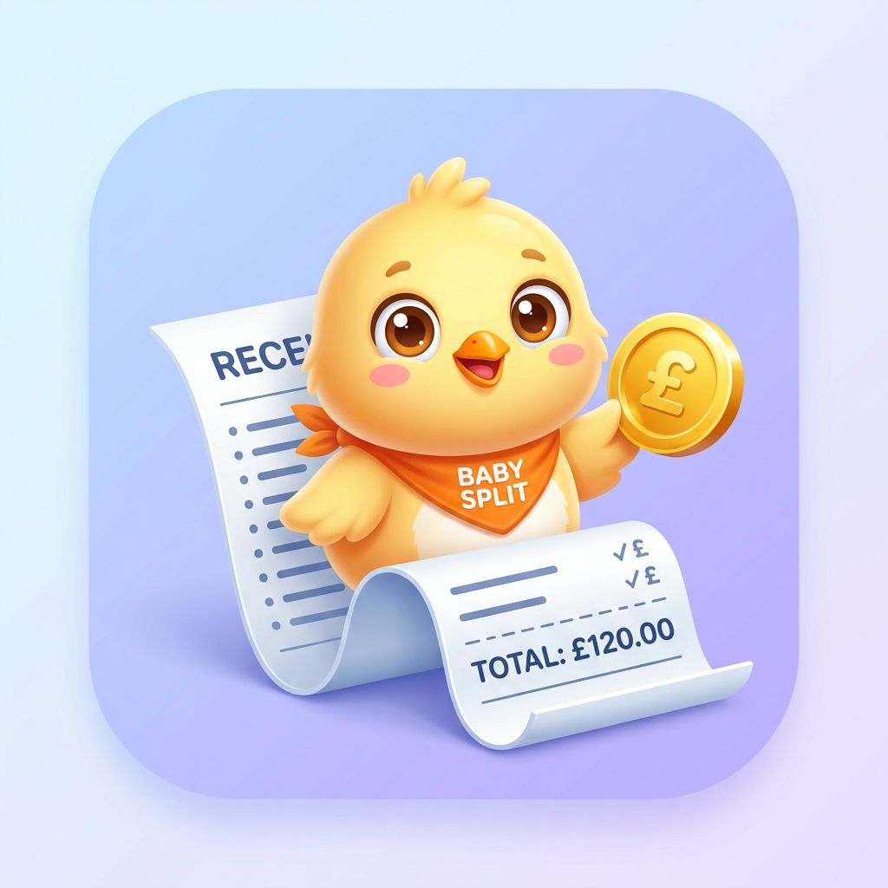

<p align="center">
  
</p>

<h1 align="center">🐥 Baby Split</h1>
<h3 align="center">Smart, 100% On-Device Splitwise Alternative for Android with WhatsApp Sharing & Automated Gmail Receipts</h3>

<p align="center">
  
  
  
  
  
</p>

---

## 📖 About Baby Split

**Baby Split** is a modern, standalone native Android application designed to effortlessly split bills, track group trip expenses, simplify circular debts, and share itemized expense breakdowns directly to friends via **WhatsApp** and **Gmail**.

Inspired by [`oss-apps/split-pro`](https://github.com/oss-apps/split-pro), Baby Split is completely decoupled from any external server infrastructure—offering zero server costs, maximum privacy, offline-first reliability, and seamless integration with the Google ecosystem (Google Drive & Gmail).

---

## 🌟 Key Highlights

### 📱 1. Single-Organizer Mode (No App Required for Friends!)
Only **ONE person** (the trip organizer/host) needs to have the app installed.
- **👤 Offline Tagged Members**: Add friends simply by name (e.g. "Alice", "Bob") with optional WhatsApp phone number.
- **✉️ Gmail Invited Members**: Add friends with their Gmail address to automatically receive itemized receipts when the event concludes.

---

### 💬 2. Comprehensive 1-Tap WhatsApp Sharing
Share itemized breakdowns, group tables, and payment details directly to WhatsApp in one tap:

#### 🔹 Individual Member Breakdown
```
🧾 *Baby Split - Bali Vacation 2026*
📅 Date: Aug 19, 2026

Hi *Alice*! Here is your itemized expense breakdown:

1. 🍔 *Dinner at Trattoria*
   • Total: $100.00
   • Your Share: *$25.00*

2. 🏨 *Villa Rental (3 Nights)*
   • Total: $300.00
   • Your Share: *$60.00*

3. 🍹 *Beach Club Drinks*
   • Total: $46.50
   • Your Share: *$15.50*

----------------------------------------
💰 *TOTAL AMOUNT YOU OWE: $100.50*
----------------------------------------

💳 *Please transfer to:*
• *Bank BCA*: 123-456-789 (a.n. Rowan)
• *PayPal*: paypal.me/rowan

Thank you! Generated with Baby Split 👶
```

#### 🔹 Group Settlement Summary
```
📊 *Baby Split - Bali Vacation 2026 (Group Summary)*
📅 Date: Aug 19, 2026
💵 Total Group Spending: *$446.50*

🤝 *Settlement Breakdown (Simplified Debts):*
----------------------------------------
• *Alice* pays *Rowan*: $100.50
• *Bob* pays *Rowan*: $85.00
• *Charlie*: Settled up ✅
----------------------------------------

💳 *Host Payment Info:*
• Bank BCA: 123-456-789 (Rowan)
```

---

### 🏁 3. "Finish Trip" Trigger & Automated Gmail Receipts
When a trip concludes:
1. Tap the **"Finish Trip"** button.
2. The app finalizes balances in Room DB.
3. Automatically dispatches rich HTML/PDF itemized receipts directly to all **Gmail-invited members**.
4. Automatically backs up the trip archive and all receipt photos to the user's personal **Google Drive** folder (`"Baby Split"`).

---

### ⚡ 4. 5-Way Mathematical Splitting Engine
High-precision integer-cent math (`SplitCalculator.kt`) with deterministic remainder distribution guaranteeing zero-sum errors ($\sum \text{Shares} == \text{TotalAmount}$):
- **`=` Equal Split**: Even distribution with remainder cents assigned deterministically.
- **`$` Exact Amounts**: Explicit custom monetary values.
- **`%` Percentages**: Percentage splits with automatic rounding corrections.
- **`1/x` Shares / Ratios**: Weighted distribution by share counts.
- **`+/-` Adjustments**: Baseline equal split with +/- custom adjustments.

---

### 🤝 5. $O(N-1)$ Debt Simplification Algorithm
Reduces complex circular group debts to a minimal set of transactions using a greedy bipartite matching algorithm.

---

### 📴 6. 100% Offline-First Architecture
- **Room SQLite Database**: All data is saved on-device with zero internet required.
- **Client-Side Image Compression**: WebP receipt image compression (<400KB) for instant loading.

---

## 🏗️ Architecture & Project Structure

```
com.babysplit.app
├── core/
│   ├── auth/           # Google Credential Manager (Native Google Sign-In)
│   ├── gdrive/         # Google Drive Cloud Storage & Backup Engine
│   ├── gmail/          # Automated Gmail Receipt Dispatcher
│   ├── whatsapp/       # WhatsApp Message Formatter & Direct Share Intents
│   ├── database/       # Room SQLite Database, DAOs, Entities
│   ├── datastore/      # User Preferences & Host Payment Details
│   ├── camera/         # Receipt Compression & Photo Handling
│   └── ui/theme/       # Material Design 3 (Dynamic Color, Dark/Light theme)
├── feature/
│   ├── dashboard/      # Dashboard, Active Trips List, Overview Cards
│   ├── group/          # Trip Management (Expenses, Balances, Totals tabs, Finish Trip)
│   ├── members/        # Offline Tagging & Gmail Invite Dialog
│   ├── expense/        # Add/Edit Expense, 5 Split Modes, Receipt Picker
│   ├── balance/        # Debt Simplification Engine & Net Balances
│   ├── settlement/     # Record Settlement Dialog
│   └── profile/        # Host Profile, Bank Info, Google Sync Settings
└── navigation/         # Compose Navigation Routes & NavGraph
```

---

## 📦 How to Build and Download the APK

### Method 1: Download from GitHub Actions (Recommended)
1. Go to the **Actions** tab in your repository: [`https://github.com/albertusro1/baby-split/actions`](https://github.com/albertusro1/baby-split/actions).
2. Click the latest **Build & Test Android APK** workflow run.
3. Download the **`BabySplit-Debug-APK`** artifact.
4. Install the `.apk` directly on your Android device!

### Method 2: Build Locally with Android Studio
1. Clone the repository:
   ```bash
   git clone https://github.com/albertusro1/baby-split.git
   ```
2. Open the project in **Android Studio** (Ladybug or newer).
3. Let Gradle sync dependencies.
4. Run `./gradlew assembleDebug` or click **Run** ▶️ to install directly onto a connected device or emulator.

---

## 🧪 Unit Tests

Run the test suite:
```bash
./gradlew test
```

Included unit tests:
- `SplitCalculatorTest`: Validates all 5 split modes and cent remainder guarantees.
- `DebtSimplificationEngineTest`: Validates circular debt reduction algorithms.
- `BillSummaryFormatterTest`: Validates WhatsApp markdown and HTML receipt generation.

---

## 📄 License

This project is licensed under the **MIT License**.
